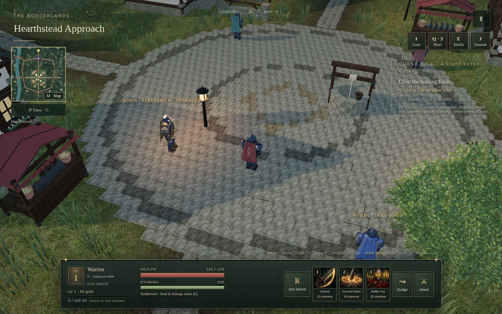
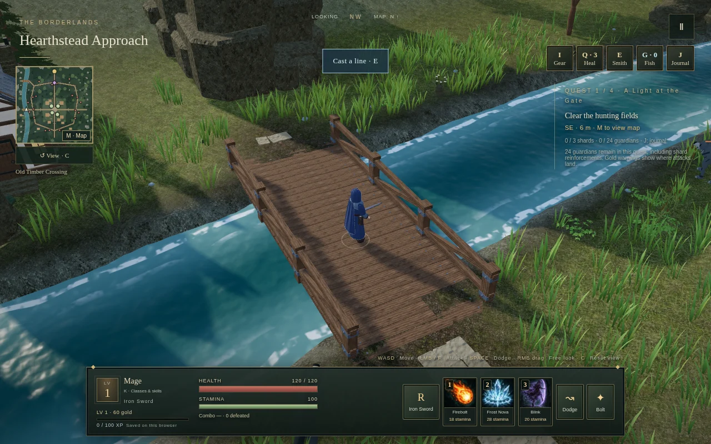
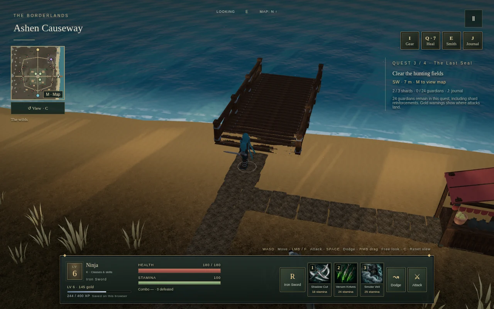

# Shards of the Blighted March

A single-player dark fantasy action RPG in your browser. Leave the safety of Hearthstead, hunt corrupted guardians, cleanse three ancient shards and confront the Fallen Warden.

Choose **Warrior, Mage, Ninja or Dwarf**, each with three unique illustrated abilities. Explore four regions of settlements, forests, rivers, hills and coastline. Collect equipment, upgrade it at the forge, sell spare gear and find your way with the detailed regional atlas.

Combat combines aimed attacks, weapon combos, stamina management and directional dodges. Travel between regions through physical portals. Progress saves automatically in the current browser; no account or multiplayer server is needed.

## Screenshots

Actual in-game captures, with the normal interface and rendering.


*Hearthstead — a safe settlement between hunts.*


*Willow Run — bridges, riverbanks and the outer wilderness.*


*Saltwind Coast — another face of the March.*

## Run locally

Install **Node.js 22 LTS** and npm, then run these commands in the project folder:

```sh
npm ci
npm start
```

Open **http://localhost:4173** in a modern browser with WebGL enabled. Serve the game over HTTP; opening `game/index.html` directly as a file will not work. The complete playable folder is `game/` and needs no build step or backend.

To play on a phone on the same trusted network, open `http://<computer-LAN-IP>:4173`. The development server listens on all network interfaces; it is intended for local use, not public hosting. Saves stay with the browser and address used to play.

### Controls

| Action | Keyboard / mouse |
| --- | --- |
| Move | WASD / arrow keys, relative to the current camera view |
| Aim / attack | Mouse / hold left click or F |
| Dodge / skills | Space / 1, 2, 3 |
| Switch weapon / heal | R / Q |
| Interact / use a portal | E |
| Inventory / atlas / journal | I / M / J |
| Choose or inspect a class | K |
| Orbit / zoom / reset camera | Right-drag / mouse wheel / C |
| Pause | Escape |

On touch screens, use the left joystick and the illustrated action buttons. Drag a free area of the world to rotate the camera; tap **View** to reset it. Classes can be changed in settlements. **New journey** lets you choose a class before confirming a fresh start.
